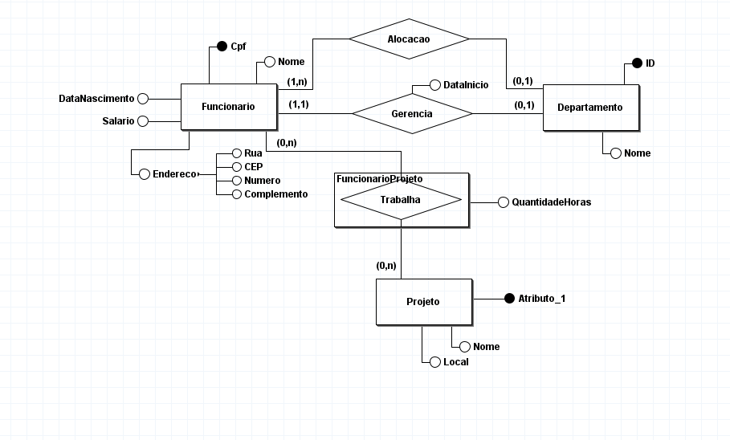
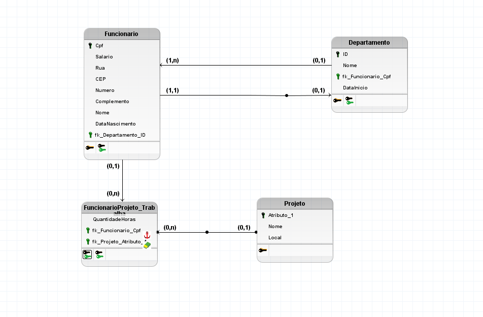
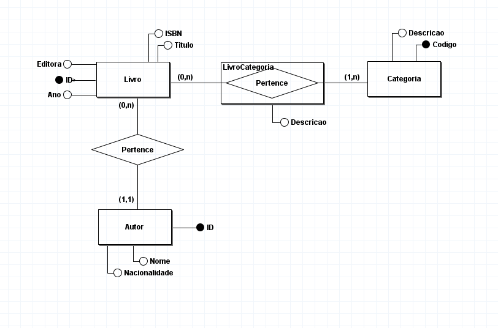
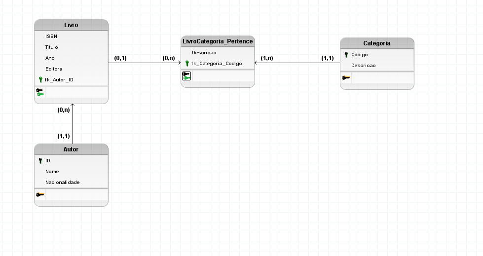

## Implemanteção de Banco de Dados
## 31/07

    Modelo Entidade Relacionamento Conceitual 
        - Pode representar um produto ou uma ação de um produto 
        - Representada por um retangulo 

    Padrões na Linguagem para SQL: 
        - PascalCase 
        - snake_case 

    Para Comandos SQL utilizar:
        - UPPERCASE 

    Chave Primária Natural:
        - Quando um atributo que ja existe pode virar chave primaria 
            - EX: cpf 
    
    Atributo composto:
        - É um atributo formado por mais de uma informação 
            - EX: Endereço
                - Dentro do enderço existem outros campos como: rua, CEP, numero, complemento 

## Forward Engineering vs Reverse Engineering 

    Forward (ENgenharia Direta):
        - Cria um produto do 0 seguindo requisitos e projetos 

    Reverse (Engenharia Reversa):
        - Analisa um produto pronto para descobrir como ele funciona e extrair seu projeto ou código original 

## Software para ciração de tabelas, banco e modelos: 
    - brModelo .jar 
 

** Realizar a Atvidade 1 até o exercício 4

## Exercícios 
1) 
    Livro: ID, ISBN, Editora, Ano, Titulo

    Autor: ID, nome, nacionalidade
    
    Categoria: Codigo, Descricao

2) 

3) 

4) 
    CREATE TABLE Livro (
        ISBN VARCHAR(13) PRIMARY KEY,
        Titulo VARCHAR(100),
        Ano DATE,
        Editora VARCHAR(100),
        fk_Autor_ID VARCHAR(100)
    );

    CREATE TABLE Categoria (
        Codigo VARCHAR(13) PRIMARY KEY,
        Descricao VARCHAR(100)
    );

    CREATE TABLE LivroCategoria_Pertence (
        Descricao VARCHAR(100),
        fk_Categoria_Codigo VARCHAR(13)
    );

    CREATE TABLE Autor (
        ID VARCHAR(100) PRIMARY KEY,
        Nome VARCHAR(100),
        Nacionalidade VARCHAR(100)
    );
    
    ALTER TABLE Livro ADD CONSTRAINT FK_Livro_1
        FOREIGN KEY (fk_Autor_ID)
        REFERENCES Autor (ID)
        ON DELETE CASCADE;
    
    ALTER TABLE LivroCategoria_Pertence ADD CONSTRAINT FK_LivroCategoria_Pertence_1
        FOREIGN KEY (fk_Categoria_Codigo)
        REFERENCES Categoria (Codigo);

